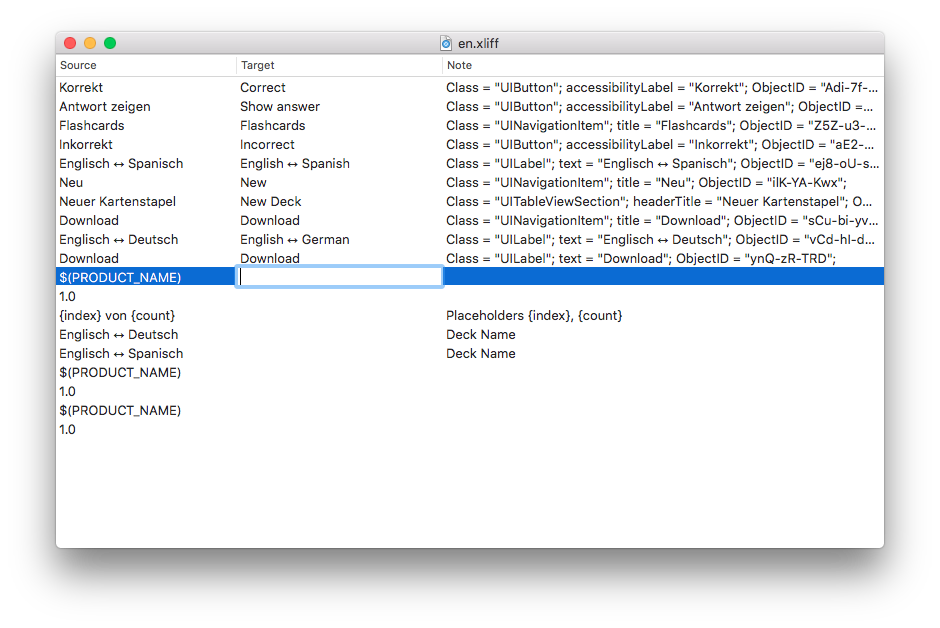

# XLIFF Editor for Mac OS X

A simple utility for editing XLIFF files created by Xcode's Export/Import localizations feature.

[Latest release](https://github.com/nixxcode/xliff-editor-osx/releases/latest)
